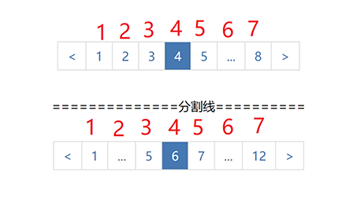
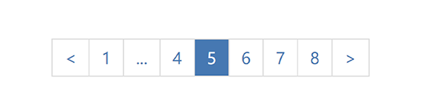
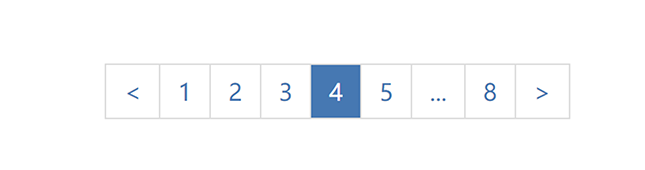
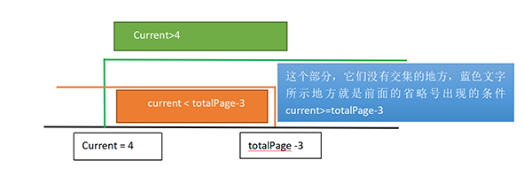

### 使用方法
> 在页面上定义一个容器,这里我定义了两个，引入css文件
```
<link href="css/pagenation.css" type="text/css" rel="stylesheet" />
<div id="test"></div>
<div style="margin:20px 0">==============分割线==========</div>
<div id="test"></div>
```
>引入js和pagenation.js,执行pagenation实例

```
<script src="js/jquery-3.6.1.min.js" id="require" ></script>
<script src="js/pagenation.js" id="require" ></script>

 $("#test").pagenation({
 	current:4, //当前页
    pageSize:10, //每页条数
    total:80,  //总条数
    onChange:(page)=>{ //页码改变的回调，返回值为当前页
        console.log(page)
    }
  })
 $("#test2").pagenation({
  	current:6,
    pageSize:10,
    total:120,
    onChange:(page)=>{
        console.log(page)
    }
  })

```
> 结果


### 分析
> 这里最关键的就是省略号的显示，在上源码之前，我们先理一下逻辑。
>  我们规定了页码>=8的时候显示省略号。我们必须知道一个关键，在显示省略号的情况下，除了前后箭头的方块,中间的方块永远只有7个,明白这个重要，如下图所示：



1. 再来分析省略号：

> **前面的省略号**
>  当前页current（也就是高亮的方块）左边的省略号，我把它称为前面的省略号。我们要知道前面的省略号的排列方式为: `首页页码，省略号，后面的页码，当前页current`。省略号一定是省略了2个以上的页码，也就是说只有当首页与current-1之间的页码>=2的时候才显示为省略号，否则直接显示页码，不显示省略号。根据这个逻辑，可以推算出  `前面的省略号出现的条件是current>4,`  如下图所示，当前页current为5，省略号替换了页码2和3的位置。如果当前页为4，根据前面的省略号的排列方式，首页页码1，省略号，后面的页码3，当前页4，那么省略号只替换了一个页码（2），不符合它替换两个以上的页码的条件，我们前面已经说过，省略号必须替换2个以上的页码，这样它的出现才有意义。
>
> 
>
> **后面的省略号**
>  当前页current（也就是高亮的方块）右边的省略号，我把它称为后面的省略号。后边的省略号的排列方式为`current,后面一个页码，省略号，末页页码`。根据后面的省略号的排列方式以及省略号必须代替2个页码以上的规则，我们可以得出后面的省略号出现的条件是`current < totalPage - 3`如下图所示
>
> 

2. 理清了上面两点，我们可以得出省略号有以下3种情况:

>  1. 只显示前面的省略号: current>4 并且!(current < totalPage - 3), 根据数学中集合的关系，得出current >= totalPage - 3，如下图所示：
>
> 
>
> 2.  只显示后面的省略号 !(current>4)并且current < totalPage - 3; 得出 current <=4，如下图所示：
>
> 
>
> 3. 前后都显示： current>4 && current < totalPage - 3
>

3. 页码渲染from,to的情况（from,to是用于渲染省略号两端或一端连续的页码）
> 1. 只显示前边的省略号时，前边是第一个页码，然后是一个省略号，我们前面已经说过总的方块数是7，7-2 = 5，后边是连续的五个页码，如下图所示
>
> 
>
 >由此得出：
 >` from = 1; to = 5`
 >
 >3. 前后省略号都显示时：第一个页码，省略号，中间三个连续方块(current是三个中间的那一个)，省略号，最后一个页码
 >
 > 
 >
  >由此得出:
 >` from =  current - 1; to = from + 2;`

4. 根据上面的分析，我们最终得出几个关键的条件式子:
```
1. 只显示前面的省略号的条件
current >= this.totalPage - 3
2. 只显示后面的省略号的条件
current <=4
3. 前后省略号都显示
current>4 && current < this.totalPage - 3

```
5. 接下来就可以编写代码了